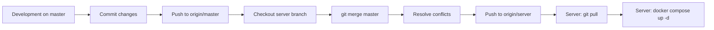

# Server Deployment Guide

This guide explains how to deploy and update the Maps Route Planner application on the Debian 13 headless server.

---

## 📋 Table of Contents

1. [Branching Strategy](#branching-strategy)
2. [Initial Server Setup](#initial-server-setup)
3. [Deployment Workflow](#deployment-workflow)
4. [Update Workflow](#update-workflow)
5. [Troubleshooting](#troubleshooting)
6. [Configuration Reference](#configuration-reference)

---

## Branching Strategy

### Repository Structure

```
master (development)
    │
    └── server (production-ready)
```

### Branch Descriptions

| Branch | Purpose | Target Environment |
|--------|---------|-------------------|
| `master` | Development branch | Local development |
| `server` | Server-ready branch | Production server |

### Workflow Summary

1. **Development**: Make changes on `master` branch
2. **Merge**: Merge `master` → `server` branch
3. **Deploy**: Server pulls from `server` branch
4. **Update**: Repeat for future updates

---

## Initial Server Setup

### Prerequisites

- Debian 13 headless server
- Docker Engine installed
- User with sudo privileges
- Git installed

### Step 1: Clone the Repository

```bash
# Navigate to project directory
cd ~/docker-projects

# Clone the server branch
git clone -b server https://github.com/ThZihan/maps_route_planner.git

# Navigate to project directory
cd maps_route_planner
```

### Step 2: Create Environment File

```bash
# Copy the server environment template
cp .env.server.example .env

# Edit the .env file with your actual values
nano .env
```

**Critical Settings to Update:**

```bash
# Change this to a strong, unique password
DB_PASSWORD=YourSecurePasswordHere123!

# Set to your Cloudflare domain in production
CORS_ORIGIN=https://maps.kalobiral.com.bd
```

### Step 3: Start the Application

```bash
# Build and start containers
docker compose -f docker-compose.server.yml up -d --build

# Verify containers are running
docker compose -f docker-compose.server.yml ps

# Check logs
docker compose -f docker-compose.server.yml logs -f
```

### Step 4: Verify Deployment

```bash
# Check if frontend is accessible
curl -I http://127.0.0.1:3001

# Check if backend is accessible
curl -I http://127.0.0.1:3000

# Check memory usage
docker stats
```

### Expected Output

```
CONTAINER ID   NAME        CPU %     MEM USAGE / LIMIT   MEM %     NET I/O     BLOCK I/O   PIDS
abc123def456  frontend    0.50%     18.5MiB / 64MiB     28.91%    1.2kB / 0B  0B / 0B     3
def456ghi789  backend     1.20%     85.3MiB / 128MiB    66.64%    2.4kB / 0B  0B / 0B     12
ghi789jkl012  nominatim   5.80%     420.1MiB / 512MiB   82.05%    15.6kB / 0B 0B / 0B     8
```

---

## Deployment Workflow

### Overview



### Step-by-Step Guide

#### On Development Machine

1. **Make changes on master branch**
   ```bash
   git checkout master
   # Make your changes...
   ```

2. **Commit and push changes**
   ```bash
   git add .
   git commit -m "Your commit message"
   git push origin master
   ```

3. **Merge to server branch**
   ```bash
   git checkout server
   git pull origin server  # Get latest server changes
   git merge master         # Merge master into server
   ```

4. **Resolve conflicts (if any)**
   ```bash
   # Review and resolve conflicts
   git status
   # Edit conflicting files...
   git add <resolved-files>
   git commit -m "Merge master into server"
   ```

5. **Push to remote**
   ```bash
   git push origin server
   ```

#### On Server

1. **Pull latest changes**
   ```bash
   cd ~/docker-projects/maps_route_planner
   git pull origin server
   ```

2. **Rebuild and restart containers**
   ```bash
   docker compose -f docker-compose.server.yml up -d --build
   ```

3. **Verify deployment**
   ```bash
   docker compose -f docker-compose.server.yml ps
   docker compose -f docker-compose.server.yml logs -f
   ```

---

## Update Workflow

### Safe Update Process

The key to safe updates is protecting your server configuration from being overwritten.

### Configuration Protection

**Protected Files (via .gitignore):**
- `.env` - Your actual environment variables with secrets
- `.env.local` - Local overrides
- `.env.*.local` - Any local environment files

**Tracked Files (safe to update):**
- `docker-compose.server.yml` - Server configuration
- `.env.server.example` - Environment template
- All application code

### Update Without Hampering Configuration

#### Method 1: Git Pull (Recommended)

Since `.env` is in `.gitignore`, it will never be overwritten by git pull:

```bash
# On server
cd ~/docker-projects/maps_route_planner
git pull origin server
docker compose -f docker-compose.server.yml up -d --build
```

**Your `.env` file remains intact!**

#### Method 2: Stash and Restore (Alternative)

If you need to protect tracked files:

```bash
# On server
cd ~/docker-projects/maps_route_planner

# Stash local changes
git stash push -m "Backup local changes"

# Pull latest
git pull origin server

# Restore local changes
git stash pop

# Rebuild
docker compose -f docker-compose.server.yml up -d --build
```

#### Method 3: Assume Unchanged (Advanced)

Mark files as unchanged to prevent accidental modifications:

```bash
# On server (one-time setup)
git update-index --assume-unchanged .env
git update-index --assume-unchanged docker-compose.server.yml

# To undo this later
git update-index --no-assume-unchanged .env
git update-index --no-assume-unchanged docker-compose.server.yml
```

### Typical Update Scenario

**Scenario:** You want to update the frontend code without changing server configuration.

```bash
# On development machine
git checkout master
# Make frontend changes...
git add frontend/
git commit -m "Update frontend UI"
git push origin master

git checkout server
git merge master
git push origin server

# On server
cd ~/docker-projects/maps_route_planner
git pull origin server
docker compose -f docker-compose.server.yml up -d --build

# Your .env file is preserved!
```

---

## Troubleshooting

### Container Won't Start

```bash
# Check container logs
docker compose -f docker-compose.server.yml logs <service-name>

# Check container status
docker compose -f docker-compose.server.yml ps -a

# Restart specific container
docker compose -f docker-compose.server.yml restart <service-name>
```

### Port Already in Use

```bash
# Check what's using the port
ss -tlnp | grep <port>

# Stop conflicting service
docker compose -f docker-compose.server.yml stop <service-name>
```

### Memory Issues

```bash
# Check real-time memory usage
docker stats

# Check system memory
free -h

# If OOM occurs, check logs
dmesg | grep -i oom
```

### Git Merge Conflicts

```bash
# View conflicts
git status

# Edit conflicting files
nano <conflicted-file>

# Mark as resolved
git add <conflicted-file>

# Complete merge
git commit -m "Resolve merge conflicts"
```

### Configuration Changes Not Applied

```bash
# Verify .env file exists
ls -la .env

# Check if .env is being used
docker compose -f docker-compose.server.yml config

# Force rebuild
docker compose -f docker-compose.server.yml down
docker compose -f docker-compose.server.yml up -d --build
```

---

## Configuration Reference

### docker-compose.server.yml

#### Service Memory Limits

| Service | Memory Limit | Actual Usage | Purpose |
|---------|--------------|--------------|---------|
| Frontend | 64M | ~20MB | nginx static file serving |
| Backend | 128M | ~90MB | Node.js API server |
| Nominatim | 512M | ~450MB | Geocoding service |
| PostgreSQL | Default | ~20-30MB | Database |
| Redis | Default | ~5-10MB | Caching |
| **Total** | **~800M** | **~600MB** | Within 2GB limit |

#### Port Bindings

| Service | External Port | Internal Port | Binding |
|---------|---------------|---------------|---------|
| Frontend | 3001 | 80 | 127.0.0.1 (localhost only) |
| Backend | 3000 | 3000 | 127.0.0.1 (localhost only) |
| Nominatim | 8081 | 8080 | 127.0.0.1 (localhost only) |
| PostgreSQL | 5432 | 5432 | 127.0.0.1 (localhost only) |
| Redis | 6379 | 6379 | 127.0.0.1 (localhost only) |

**Security Note:** All services bound to localhost only. Only accessible via Cloudflare Tunnel.

#### OSRM Configuration

**Default:** Using public API (https://router.project-osrm.org) to save memory.

**To enable local OSRM:**
1. Uncomment the `osrm-backend` service in `docker-compose.server.yml`
2. Change `OSRM_URL` in `.env` to `http://osrm-backend:5000`
3. Rebuild containers: `docker compose -f docker-compose.server.yml up -d --build`
4. **Note:** This will use additional ~768MB memory

### Environment Variables

| Variable | Default | Description |
|----------|---------|-------------|
| `NODE_ENV` | `production` | Application environment |
| `BACKEND_PORT` | `3000` | Backend API port |
| `FRONTEND_PORT` | `3001` | Frontend port |
| `FRONTEND_URL` | `http://localhost:3001` | Frontend URL for CORS |
| `CORS_ORIGIN` | `*` | CORS allowed origins |
| `DB_PASSWORD` | Required | PostgreSQL password |
| `OSRM_URL` | `https://router.project-osrm.org` | OSRM routing API |
| `NOMINATIM_URL` | `http://nominatim:8080` | Nominatim geocoding URL |

---

## Quick Reference Commands

### Server Management

```bash
# Start containers
docker compose -f docker-compose.server.yml up -d

# Stop containers
docker compose -f docker-compose.server.yml down

# Restart containers
docker compose -f docker-compose.server.yml restart

# View logs
docker compose -f docker-compose.server.yml logs -f

# Rebuild containers
docker compose -f docker-compose.server.yml up -d --build

# Check container status
docker compose -f docker-compose.server.yml ps

# Check resource usage
docker stats
```

### Git Operations

```bash
# Pull latest changes
git pull origin server

# Check git status
git status

# View recent commits
git log --oneline -10

# Merge master into server
git merge master
```

### System Monitoring

```bash
# Check system memory
free -h

# Check disk space
df -h

# Check Docker disk usage
docker system df

# Clean up unused Docker resources
docker system prune -a
```

---

## Security Checklist

- [ ] `.env` file is NOT committed to git
- [ ] `DB_PASSWORD` is set to a strong, unique password
- [ ] All services bound to `127.0.0.1` (localhost only)
- [ ] Cloudflare Tunnel configured for HTTPS access
- [ ] Firewall rules configured (if applicable)
- [ ] Regular security updates applied to server

---

## Support

For issues or questions:
1. Check the troubleshooting section above
2. Review container logs: `docker compose -f docker-compose.server.yml logs`
3. Check server documentation in `plans/` directory
4. Open an issue on GitHub

---

## Version History

| Version | Date | Changes |
|---------|------|---------|
| 1.0 | 2025-03-18 | Initial server deployment guide |
