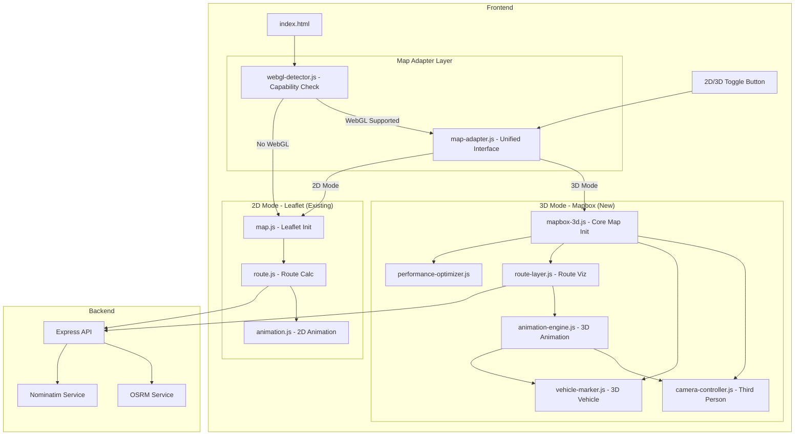
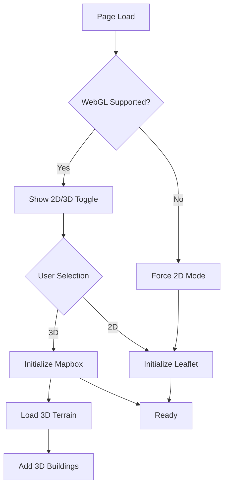
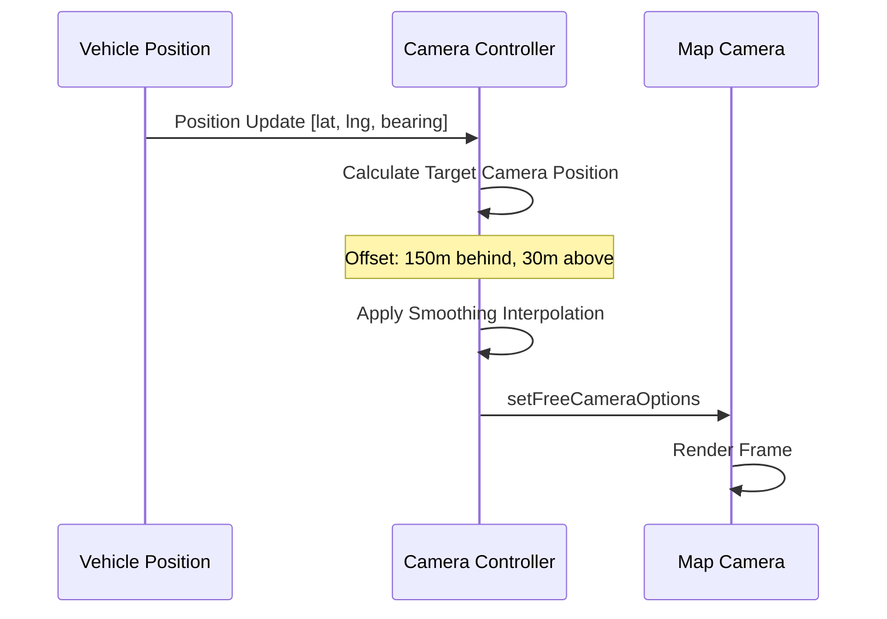
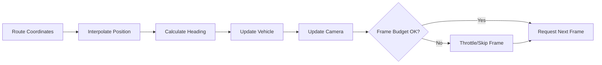

# 3D Mapbox GL JS Implementation Plan

## Overview

This plan outlines the **hybrid implementation** that adds Mapbox GL JS for 3D vehicle tracking animation alongside the existing Leaflet.js 2D implementation. The system includes:

1. **2D/3D Toggle**: Users can switch between Leaflet (2D) and Mapbox (3D) views
2. **WebGL Fallback**: Automatic fallback to Leaflet if WebGL is not supported
3. **Third-person camera**: Action game-style camera following the vehicle
4. **Resource optimization**: Adaptive quality for constrained environments and mobile devices

## Requirements Summary

| Requirement | Specification |
|-------------|---------------|
| Primary Map Library | Mapbox GL JS v3.x (3D mode) |
| Fallback Map Library | Leaflet.js (2D mode - existing) |
| Vehicle Representation | Simple 3D marker (HTML/CSS based) |
| Camera Pitch | 45 degrees |
| Camera Distance | 150 meters behind vehicle |
| Device Support | Desktop + Mobile |
| WebGL Fallback | Automatic to Leaflet if unsupported |
| Mapbox Token | `YOUR_MAPBOX_PUBLIC_TOKEN_HERE` (configure in config.js) |

---

## Architecture Overview

### Hybrid 2D/3D System Architecture



### Mode Switching Flow



---

## File Structure Changes

### Current Structure (Leaflet) - PRESERVED
```
frontend/
├── index.html
├── css/
│   └── style.css
└── js/
    ├── map.js          # Leaflet map initialization (KEEP AS IS)
    ├── route.js        # Route calculation (KEEP AS IS)
    └── animation.js    # Vehicle animation (KEEP AS IS)
```

### New Hybrid Structure (2D + 3D)
```
frontend/
├── index.html                 # Updated with toggle UI
├── css/
│   ├── style.css             # Base styles (existing)
│   └── mapbox-3d.css         # 3D-specific styles (new)
└── js/
    ├── map.js                # Leaflet 2D (existing - unchanged)
    ├── route.js              # Route calculation (existing - unchanged)
    ├── animation.js          # 2D animation (existing - unchanged)
    │
    ├── core/                 # NEW - 3D Core Modules
    │   ├── map-adapter.js    # Unified interface for 2D/3D switching
    │   ├── webgl-detector.js # WebGL capability detection
    │   ├── mapbox-3d.js      # Mapbox initialization + 3D terrain
    │   └── config.js         # Centralized configuration
    │
    ├── components/           # NEW - 3D Components
    │   ├── vehicle-marker.js # 3D vehicle marker
    │   ├── route-layer.js    # Route visualization
    │   └── camera-controller.js # Third-person camera
    │
    ├── animation/            # NEW - 3D Animation
    │   ├── animation-engine-3d.js # Main animation loop
    │   ├── easing-functions.js    # Smooth interpolation
    │   └── frame-optimizer.js     # RAF optimization
    │
    ├── utils/                # NEW - Utilities
    │   ├── performance-monitor.js # FPS tracking
    │   ├── mobile-detector.js     # Device capability detection
    │   └── math-utils.js          # Coordinate calculations
    │
    └── main.js               # NEW - Entry point with mode detection
```

### Key Points:
1. **Existing files are NOT modified** - Leaflet implementation remains intact
2. **New files are additive** - 3D modules are in separate directories
3. **Adapter pattern** - `map-adapter.js` provides unified interface
4. **Easy rollback** - Simply remove `core/`, `components/`, `animation/`, `utils/` directories

---

## Core Modules Specification

### 0. WebGL Detector (`webgl-detector.js`) - NEW

Detects WebGL capability and determines which map mode to use.

```javascript
class WebGLDetector {
    static detect() {
        const canvas = document.createElement('canvas');
        const gl = canvas.getContext('webgl2') ||
                   canvas.getContext('webgl') ||
                   canvas.getContext('experimental-webgl');
        
        return {
            supported: !!gl,
            webgl2: !!canvas.getContext('webgl2'),
            maxTextureSize: gl ? gl.getParameter(gl.MAX_TEXTURE_SIZE) : 0,
            recommended: this.getRecommendation(gl)
        };
    }
    
    static getRecommendation(gl) {
        if (!gl) return '2d';
        
        // Check for low-end devices
        const textureSize = gl.getParameter(gl.MAX_TEXTURE_SIZE);
        const renderer = gl.getParameter(gl.RENDERER);
        
        // Mobile or integrated GPUs might struggle with 3D
        if (textureSize < 4096) return '2d';
        if (renderer.includes('SwiftShader')) return '2d';
        
        return '3d';
    }
}
```

### 1. Map Adapter (`map-adapter.js`) - NEW

Unified interface for switching between 2D (Leaflet) and 3D (Mapbox) modes.

```javascript
class MapAdapter {
    constructor() {
        this.currentMode = '2d'; // '2d' or '3d'
        this.maps = {
            leaflet: null,  // Existing Leaflet map
            mapbox: null    // New Mapbox map
        };
        this.sharedState = {
            route: null,
            vehicle: null,
            animation: null
        };
    }
    
    async switchMode(newMode) {
        if (this.currentMode === newMode) return;
        
        // Save current state
        this.saveState();
        
        // Hide current map
        this.hideMap(this.currentMode);
        
        // Show new map
        if (newMode === '3d' && !this.maps.mapbox) {
            await this.initializeMapbox();
        }
        
        this.showMap(newMode);
        
        // Restore state on new map
        this.restoreState(newMode);
        
        this.currentMode = newMode;
    }
    
    saveState() {
        // Save route coordinates, vehicle position, animation progress
        this.sharedState.route = window.routeCoordinates;
        this.sharedState.progress = window.animationProgress;
    }
    
    restoreState(mode) {
        // Apply saved state to the active map
        if (mode === '3d') {
            // Initialize 3D route and vehicle
        } else {
            // Use existing Leaflet logic
        }
    }
}
```

### 2. Configuration Module (`config.js`)

Centralized configuration for easy tuning and environment adaptation.

```javascript
// Key configuration values
const CONFIG = {
    // Mode settings
    defaultMode: 'auto', // '2d', '3d', or 'auto' (based on WebGL detection)
    
    mapbox: {
        token: window.MAPBOX_TOKEN || 'YOUR_MAPBOX_PUBLIC_TOKEN_HERE',
        style: 'mapbox://styles/mapbox/streets-v12',
        terrainSource: 'mapbox://mapbox.mapbox-terrain-dem-v1'
    },
    camera: {
        pitch: 45,
        distance: 150, // meters behind vehicle
        heightOffset: 30, // meters above vehicle
        smoothingFactor: 0.15, // camera lag for smooth follow
        maxSpeed: 500 // km/h for interpolation
    },
    performance: {
        targetFPS: 60,
        minZoom3D: 14, // Enable 3D buildings only above this zoom
        buildingMinZoom: 15,
        terrainExaggeration: 1.2,
        enableMobileOptimizations: true
    },
    vehicle: {
        markerSize: 40, // pixels
        updateInterval: 16 // ~60fps
    }
};
```

### 3. Map Initialization (`mapbox-3d.js`)

Handles Mapbox map creation with 3D terrain and buildings.

**Key Features:**
- Terrain DEM source for elevation data
- 3D building extrusion layer
- Dynamic layer management based on zoom level
- Memory-efficient source handling

**Optimization Strategies:**
- Lazy load terrain data (only when needed)
- Disable 3D buildings on mobile at lower zoom levels
- Use `map.showTileBoundaries = false` in production
- Implement source caching

### 3. Camera Controller (`camera-controller.js`)

Implements third-person camera following behavior.

**Camera Behavior:**


**Smoothing Algorithm:**
- Use exponential smoothing for camera position
- Implement lookahead based on vehicle velocity
- Apply bearing interpolation for smooth rotation

### 4. Vehicle Marker (`vehicle-marker.js`)

Custom 3D marker implementation using Mapbox Marker or CustomLayer.

**Implementation Approach:**
- Use `mapboxgl.Marker` with custom HTML element
- CSS3 transform for rotation based on heading
- Lightweight SVG-based vehicle icon
- Optional: Add shadow layer for depth perception

### 5. Animation Engine (`animation-engine.js`)

Core animation loop with performance optimizations.

**Animation Pipeline:**


**Performance Features:**
- Frame budget monitoring
- Adaptive frame skipping
- Coordinate pre-calculation
- Batched updates

---

## Optimization Strategies

### For Resource-Constrained Environments

#### 1. Adaptive Quality System

```javascript
class PerformanceOptimizer {
    constructor() {
        this.fpsHistory = [];
        this.currentQuality = 'high'; // high, medium, low
    }
    
    monitorFPS(currentFPS) {
        this.fpsHistory.push(currentFPS);
        if (this.fpsHistory.length > 60) {
            this.fpsHistory.shift();
            this.adjustQuality();
        }
    }
    
    adjustQuality() {
        const avgFPS = this.fpsHistory.reduce((a, b) => a + b) / this.fpsHistory.length;
        
        if (avgFPS < 30 && this.currentQuality !== 'low') {
            this.downgradeQuality();
        } else if (avgFPS > 55 && this.currentQuality !== 'high') {
            this.upgradeQuality();
        }
    }
    
    downgradeQuality() {
        // Reduce building opacity
        // Increase camera smoothing (fewer updates)
        // Disable terrain exaggeration
        // Reduce route line detail
    }
}
```

#### 2. Memory Management

| Strategy | Implementation |
|----------|----------------|
| Source Cleanup | Remove unused GeoJSON sources after animation |
| Layer Pooling | Reuse layer objects instead of recreate |
| Coordinate Simplification | Use Douglas-Peucker algorithm for route simplification |
| Tile Cache | Limit tile cache size on mobile |

#### 3. Mobile-Specific Optimizations

```javascript
const mobileOptimizations = {
    // Reduce building density
    buildingFilter: ['<', ['get', 'height'], 50],
    
    // Lower terrain resolution
    terrainTileSize: 256, // vs 512 on desktop
    
    // Simplified route rendering
    routeTolerance: 0.0001, // higher = fewer points
    
    // Throttled camera updates
    cameraUpdateInterval: 32, // ~30fps instead of 60fps
    
    // Disable expensive effects
    enableFog: false,
    enableSky: false
};
```

#### 4. Animation Loop Optimization

```javascript
class OptimizedAnimationLoop {
    constructor() {
        this.lastFrameTime = 0;
        this.frameInterval = 1000 / 60; // Target 60fps
        this.accumulatedTime = 0;
    }
    
    animate(currentTime) {
        const deltaTime = currentTime - this.lastFrameTime;
        this.lastFrameTime = currentTime;
        
        // Accumulate time for consistent updates
        this.accumulatedTime += deltaTime;
        
        // Fixed timestep updates (prevents spiral of death)
        while (this.accumulatedTime >= this.frameInterval) {
            this.update(this.frameInterval);
            this.accumulatedTime -= this.frameInterval;
        }
        
        // Always render
        this.render(this.accumulatedTime / this.frameInterval);
        
        if (this.isPlaying) {
            requestAnimationFrame((t) => this.animate(t));
        }
    }
}
```

---

## Implementation Phases

### Phase 0: Hybrid Infrastructure (Priority: Critical) - NEW

1. **WebGL Detection System**
   - Create `webgl-detector.js` module
   - Implement capability detection
   - Add fallback recommendation logic
   - Store detection results in localStorage

2. **Map Adapter Layer**
   - Create `map-adapter.js` unified interface
   - Implement state preservation between modes
   - Add mode switching logic
   - Create shared state management

3. **UI Toggle Component**
   - Add 2D/3D toggle button to sidebar
   - Show/hide based on WebGL support
   - Persist user preference in localStorage
   - Add visual feedback during mode switch

```html
<!-- Toggle UI to add to index.html -->
<div id="map-mode-toggle" class="mode-toggle">
    <button id="btn-2d" class="mode-btn active">2D</button>
    <button id="btn-3d" class="mode-btn">3D</button>
</div>
```

### Phase 1: Core 3D Migration (Priority: High)

1. **Setup Mapbox GL JS**
   - Add Mapbox GL JS CDN/scripts to HTML (lazy load)
   - Create configuration module with token
   - Initialize basic map with terrain
   - **Keep existing Leaflet code untouched**

2. **Port Route Functionality**
   - Create new `route-layer.js` for Mapbox
   - Implement GeoJSON source for route line
   - Add route layer with styling
   - **Reuse existing API calls (no backend changes)**

3. **Basic Vehicle Marker**
   - Create custom HTML marker for 3D
   - Implement position updates
   - Add heading/rotation support
   - **Mirror existing Leaflet marker behavior**

### Phase 2: 3D Camera System (Priority: High)

1. **Third-Person Camera**
   - Implement FreeCamera API
   - Calculate offset position behind vehicle
   - Add smooth interpolation

2. **Camera Animation**
   - Follow vehicle along route
   - Smooth bearing transitions
   - Handle route curves gracefully

### Phase 3: 3D Environment (Priority: Medium)

1. **Terrain & Buildings**
   - Add DEM terrain source
   - Configure building extrusion layer
   - Implement zoom-based visibility

2. **Visual Enhancements**
   - Add fog/atmosphere effects (desktop only)
   - Route glow effects
   - Shadow under vehicle marker

### Phase 4: Performance Optimization (Priority: High)

1. **Adaptive Quality**
   - Implement FPS monitoring
   - Create quality presets
   - Auto-adjust based on performance

2. **Mobile Optimization**
   - Device capability detection
   - Reduced quality presets
   - Touch interaction optimization

### Phase 5: Polish & Testing (Priority: Medium)

1. **UI/UX Improvements**
   - Loading states
   - Error handling
   - Responsive controls
   - Mode switch animation

2. **Cross-Browser Testing**
   - Chrome, Firefox, Safari, Edge
   - Mobile browsers (iOS Safari, Chrome Android)
   - **Test fallback to 2D on all browsers**

---

## Key Code Patterns

### Third-Person Camera Calculation

```javascript
function calculateCameraPosition(vehicleLngLat, vehicleBearing, distance, pitch) {
    // Convert bearing to radians and reverse (camera is behind)
    const bearingRad = (vehicleBearing * Math.PI) / 180;
    
    // Calculate offset in meters, then convert to degrees
    const offsetLng = (distance * Math.sin(bearingRad)) / 111000;
    const offsetLat = (distance * Math.cos(bearingRad)) / 111000;
    
    // Camera position (behind and above vehicle)
    const cameraLngLat = [
        vehicleLngLat[0] - offsetLng,
        vehicleLngLat[1] - offsetLat
    ];
    
    // Altitude in meters (for terrain following)
    const altitude = distance * Math.tan((90 - pitch) * Math.PI / 180);
    
    return {
        position: cameraLngLat,
        altitude: altitude,
        lookAt: vehicleLngLat
    };
}
```

### Smooth Camera Following

```javascript
function updateCameraSmooth(targetPosition, targetLookAt, smoothingFactor) {
    const camera = map.getFreeCameraOptions();
    
    // Exponential smoothing for position
    camera.position.x += (targetPosition.x - camera.position.x) * smoothingFactor;
    camera.position.y += (targetPosition.y - camera.position.y) * smoothingFactor;
    camera.position.z += (targetPosition.z - camera.position.z) * smoothingFactor;
    
    // Direct look-at for responsiveness
    camera.lookAtPoint(targetLookAt);
    
    map.setFreeCameraOptions(camera);
}
```

---

## Resource Budget Guidelines

| Resource | Desktop Limit | Mobile Limit |
|----------|---------------|--------------|
| JavaScript Bundle | < 500KB | < 300KB |
| Memory Usage | < 200MB | < 100MB |
| GPU Memory | < 150MB | < 75MB |
| Target FPS | 60 | 30 |
| Initial Load Time | < 3s | < 5s |

---

## Dependencies

### Required (CDN)
```html
<!-- Mapbox GL JS -->
<script src="https://api.mapbox.com/mapbox-gl-js/v3.18.0/mapbox-gl.js"></script>
<link href="https://api.mapbox.com/mapbox-gl-js/v3.18.0/mapbox-gl.css" rel="stylesheet">
```

### Optional (for enhanced features)
- **Turf.js** - For geospatial calculations (distance, bearing)
- **gsap** - For advanced easing animations (alternative: custom easing)

---

## Testing Checklist

### 2D Mode (Leaflet) - Existing Functionality
- [ ] 2D map loads correctly
- [ ] Route calculation works
- [ ] Vehicle animation works
- [ ] All existing features remain functional

### 3D Mode (Mapbox) - New Functionality
- [ ] Map loads correctly with terrain
- [ ] 3D buildings appear at appropriate zoom level
- [ ] Route renders correctly
- [ ] Vehicle marker follows route
- [ ] Camera follows vehicle smoothly
- [ ] Animation plays/pauses/resets correctly
- [ ] Performance is acceptable on mobile
- [ ] Touch controls work on mobile
- [ ] No memory leaks during long animations

### Mode Switching
- [ ] 2D/3D toggle button appears when WebGL is supported
- [ ] Toggle button hidden when WebGL is not supported
- [ ] Switching modes preserves route data
- [ ] Switching modes preserves animation progress
- [ ] Mode preference persists across page reloads

### Fallback
- [ ] Automatic fallback to 2D when WebGL is unavailable
- [ ] Graceful message shown to user when 3D is unavailable
- [ ] Low-end device detection works correctly

---

## Rollback Strategy

If 3D implementation causes issues, rollback is simple:

1. **Quick Rollback**: Remove the 2D/3D toggle button from UI
   ```javascript
   // In main.js, set default mode to '2d'
   CONFIG.defaultMode = '2d';
   ```

2. **Full Rollback**: Delete the new directories
   ```
   Remove:
   - frontend/js/core/
   - frontend/js/components/
   - frontend/js/animation/
   - frontend/js/utils/
   - frontend/js/main.js
   - frontend/css/mapbox-3d.css
   ```

3. **Restore Original**: Revert index.html to load only Leaflet scripts

The existing Leaflet files (`map.js`, `route.js`, `animation.js`) are never modified, so rollback is always safe.

---

## Backend Compatibility

The existing backend (OSRM + Nominatim) requires **no changes**. The route API returns GeoJSON which is directly compatible with both:
- Leaflet (via `L.geoJSON()`)
- Mapbox GL JS (via `map.addSource()`)

---

## Next Steps

1. **Review this plan** - Ensure all requirements are captured
2. **Approve the plan** - Confirm the hybrid 2D/3D approach
3. **Switch to Code mode** - Begin implementation
4. **Start with Phase 0** - Build the infrastructure for mode switching
5. **Iterate through phases** - Test each phase before moving to next

---

## Summary

This plan implements a **hybrid 2D/3D map system** that:

| Feature | Implementation |
|---------|----------------|
| **2D Mode** | Existing Leaflet.js (unchanged) |
| **3D Mode** | New Mapbox GL JS with terrain + buildings |
| **Toggle** | User can switch between modes |
| **WebGL Fallback** | Automatic to 2D if unsupported |
| **Camera** | Third-person, 45° pitch, 150m distance |
| **Performance** | Adaptive quality, mobile optimized |
| **Rollback** | Simple - just disable 3D mode |

The implementation is **additive** - no existing code is modified, making it safe and easily reversible.
