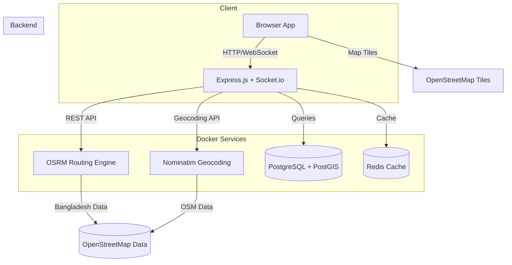
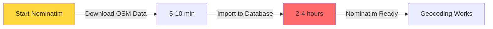
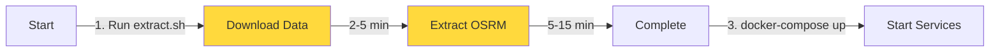

# Maps Project Deployment Plan

## Project Overview

A production-ready web application for route planning, vehicle simulation, and real-time location tracking.

**Tech Stack:**
- **Frontend**: Vanilla JavaScript + Leaflet.js
- **Backend**: Node.js + Express.js
- **Routing Engine**: OSRM (self-hosted in Docker)
- **Geocoding**: Nominatim (self-hosted in Docker)
- **Real-time**: Socket.io (WebSockets)
- **Database**: PostgreSQL + PostGIS (future)
- **Caching**: Redis (future)
- **Deployment**: Docker Compose

---

## Architecture Overview



---

## Phase 1: Project Setup & Structure

### 1.1 Create Project Directory Structure

```
maps_testing/
├── backend/
│   ├── src/
│   │   ├── config/
│   │   │   └── database.js
│   │   ├── controllers/
│   │   │   └── routeController.js
│   │   ├── middleware/
│   │   │   ├── errorHandler.js
│   │   │   └── rateLimiter.js
│   │   ├── routes/
│   │   │   └── index.js
│   │   ├── services/
│   │   │   ├── osrmService.js
│   │   │   └── nominatimService.js
│   │   ├── socket/
│   │   │   └── socketHandler.js
│   │   ├── utils/
│   │   │   └── logger.js
│   │   └── app.js
│   ├── package.json
│   ├── Dockerfile
│   └── .env.example
├── frontend/
│   ├── css/
│   │   └── style.css
│   ├── js/
│   │   ├── map.js
│   │   ├── route.js
│   │   └── animation.js
│   ├── index.html
│   ├── build.sh
│   └── package.json
├── docker/
│   ├── nginx/
│   │   └── nginx.conf
│   └── osrm/
│       ├── Dockerfile
│       └── extract.sh
├── scripts/
│   └── backup.sh
├── data/
│   ├── osrm/
│   └── nominatim/
├── docker-compose.yml
├── docker-compose.prod.yml
├── .env
├── .env.example
├── .gitignore
└── README.md
```

### 1.2 Initialize Node.js Project

```bash
# Initialize backend
cd backend
npm init -y

# Install core dependencies
npm install express socket.io cors helmet dotenv axios
npm install winston express-validator express-rate-limit

# Install dev dependencies
npm install nodemon --save-dev
```

---

## Phase 2: Docker Services Setup

### 2.1 Docker Compose Configuration (Development)

Create `docker-compose.yml`:

```yaml
version: '3.8'

services:
  # OSRM Routing Engine
  osrm-backend:
    image: osrm/osrm-backend:latest
    container_name: osrm-backend
    ports:
      - "5000:5000"
    volumes:
      - ./data/osrm:/data
    command: >
      osrm-routed --algorithm mld /data/bangladesh-latest.osrm
    restart: unless-stopped
    networks:
      - maps-network

  # Nominatim Geocoding Service
  nominatim:
    image: mediagis/nominatim:4.2  # Pin specific version
    container_name: nominatim
    ports:
      - "8080:8080"
    environment:
      - PBF_URL=https://download.geofabrik.de/asia/bangladesh-latest.osm.pbf
      - REPLICATION_URL=https://download.geofabrik.de/asia/bangladesh-updates
      - REPLICATION_UPDATE_INTERVAL=86400
      - REPLICATION_RECHECK_INTERVAL=86400
    volumes:
      - nominatim-data:/var/lib/postgresql/data  # Generic path
    restart: unless-stopped
    networks:
      - maps-network
    healthcheck:
      test: ["CMD", "wget", "--quiet", "--tries=1", "--spider", "http://localhost:8080/search?q=test"]
      interval: 30s
      timeout: 10s
      retries: 3
      start_period: 3600s  # Allow 1 hour for first-time initialization

  # PostgreSQL (for future use)
  postgres:
    image: postgis/postgis:15-3.3-alpine
    container_name: postgres
    ports:
      - "5432:5432"
    environment:
      - POSTGRES_DB=mapsdb
      - POSTGRES_USER=mapsuser
      - POSTGRES_PASSWORD=${DB_PASSWORD}
    volumes:
      - postgres-data:/var/lib/postgresql/data
    restart: unless-stopped
    networks:
      - maps-network

  # Redis (for future use)
  redis:
    image: redis:7-alpine
    container_name: redis
    ports:
      - "6379:6379"
    volumes:
      - redis-data:/data
    restart: unless-stopped
    networks:
      - maps-network

  # Backend API
  backend:
    build:
      context: ./backend
      dockerfile: Dockerfile
    container_name: backend
    ports:
      - "${BACKEND_PORT:-3000}:3000"
    environment:
      - NODE_ENV=${NODE_ENV:-development}
      - PORT=${BACKEND_PORT:-3000}
      - FRONTEND_URL=${FRONTEND_URL:-http://localhost}
      - CORS_ORIGIN=${CORS_ORIGIN:-*}
      - OSRM_URL=http://osrm-backend:5000
      - NOMINATIM_URL=http://nominatim:8080
      - DB_HOST=postgres
      - DB_PORT=5432
      - DB_NAME=mapsdb
      - DB_USER=mapsuser
      - DB_PASSWORD=${DB_PASSWORD}
      - REDIS_URL=redis://redis:6379
    depends_on:
      osrm-backend:
        condition: service_started
      nominatim:
        condition: service_healthy
      postgres:
        condition: service_started
      redis:
        condition: service_started
    restart: unless-stopped
    networks:
      - maps-network

  # Frontend (served via nginx)
  frontend:
    image: nginx:alpine
    container_name: frontend
    ports:
      - "${FRONTEND_PORT:-80}:80"
    volumes:
      - ./frontend:/usr/share/nginx/html
      - ./docker/nginx/nginx.conf:/etc/nginx/nginx.conf:ro
    depends_on:
      - backend
    restart: unless-stopped
    networks:
      - maps-network

volumes:
  postgres-data:
  redis-data:
  nominatim-data:  # Add Nominatim volume

networks:
  maps-network:
    driver: bridge
```

### 2.2 CRITICAL: Nominatim First-Time Setup Warning



**⚠ CRITICAL: Nominatim initialization is SLOW on first run.**

Expected timeline:
- **Download OSM data**: 5-10 minutes (~200MB)
- **Import to database**: 2-4 hours (on 2GB VPS)
- **Total disk usage during import**: ~2-3GB (reduces to ~1GB after)

During this time:
- Geocoding/search will NOT work
- Backend API will return errors for `/api/search`
- You must wait for complete initialization

Check Nominatim logs:
```bash
docker logs -f nominatim
```

When you see "Nominatim is ready" - it's done.

**Alternative: Skip Nominatim initially, use public API for testing:**
- Change `NOMINATIM_URL` to `https://nominatim.openstreetmap.org`
- Add rate limiting (1 request per second)
- Deploy Nominatim separately and switch later

### 2.3 OSRM Data Preparation

Create `docker/osrm/extract.sh`:

```bash
#!/bin/bash

# Download Bangladesh OSM data
echo "Downloading Bangladesh OSM data (~200MB)..."
wget https://download.geofabrik.de/asia/bangladesh-latest.osm.pbf -O ../data/osrm/bangladesh-latest.osm.pbf

echo "Extracting OSRM data..."
# Extract OSRM data using Docker
docker run -t -v "${PWD}/../data/osrm:/data" osrm/osrm-backend:latest \
  osrm-extract -p /opt/car.lua /data/bangladesh-latest.osm.pbf

echo "Preparing routing data..."
# Prepare routing data
docker run -t -v "${PWD}/../data/osrm:/data" osrm/osrm-backend:latest \
  osrm-partition /data/bangladesh-latest.osrm

docker run -t -v "${PWD}/../data/osrm:/data" osrm/osrm-backend:latest \
  osrm-customize /data/bangladesh-latest.osrm

echo "OSRM data preparation complete!"
```

### 2.4 Environment Configuration

Create `.env.example`:

```env
# Application
NODE_ENV=development
BACKEND_PORT=3000
FRONTEND_PORT=80
FRONTEND_URL=http://localhost
CORS_ORIGIN=*

# Database
DB_PASSWORD=your_secure_password_here

# API Keys (if needed for future services)
# GOOGLE_MAPS_API_KEY=
```

Create `.env` (development):

```env
# Application
NODE_ENV=development
BACKEND_PORT=3000
FRONTEND_PORT=80
FRONTEND_URL=http://localhost
CORS_ORIGIN=*

# Database
DB_PASSWORD=your_secure_password_here
```

---

## Phase 3: Backend Implementation

### 3.1 Express App Setup (`backend/src/app.js`)

```javascript
require('dotenv').config();
const express = require('express');
const http = require('http');
const { Server } = require('socket.io');
const cors = require('cors');
const helmet = require('helmet');
const routes = require('./routes');
const { errorHandler } = require('./middleware/errorHandler');
const { initializeSocket } = require('./socket/socketHandler');
const logger = require('./utils/logger');

const app = express();
const server = http.createServer(app);
const io = new Server(server, {
  cors: {
    origin: process.env.CORS_ORIGIN || '*',
    credentials: true,
    methods: ['GET', 'POST']
  }
});

// Middleware
app.use(helmet({
  contentSecurityPolicy: false, // Disable CSP for development
}));
app.use(cors());
app.use(express.json());
app.use(express.static('../frontend'));

// Routes
app.use('/api', routes);

// Socket.io initialization
initializeSocket(io);

// Error handling
app.use(errorHandler);

const PORT = process.env.PORT || 3000;

server.listen(PORT, () => {
  logger.info(`Server running on port ${PORT}`);
  logger.info(`OSRM URL: ${process.env.OSRM_URL}`);
  logger.info(`Nominatim URL: ${process.env.NOMINATIM_URL}`);
  logger.info(`CORS Origin: ${process.env.CORS_ORIGIN}`);
});

// Graceful shutdown
process.on('SIGTERM', () => {
  logger.info('SIGTERM received, shutting down gracefully');
  server.close(() => {
    logger.info('Server closed');
    process.exit(0);
  });
});

module.exports = { app, io };
```

### 3.2 OSRM Service (`backend/src/services/osrmService.js`)

```javascript
const axios = require('axios');
const OSRM_URL = process.env.OSRM_URL || 'http://localhost:5000';
const logger = require('../utils/logger');

class OSRMService {
  async getRoute(start, end) {
    try {
      const response = await axios.get(`${OSRM_URL}/route/v1/driving/${start};${end}`, {
        params: {
          overview: 'full',
          geometries: 'geojson',
          steps: true
        },
        timeout: 10000
      });

      return {
        success: true,
        data: response.data
      };
    } catch (error) {
      logger.error('OSRM Error:', error.message);
      return {
        success: false,
        error: error.message
      };
    }
  }

  async getDistance(start, end) {
    try {
      const response = await axios.get(`${OSRM_URL}/route/v1/driving/${start};${end}`, {
        params: {
          overview: false
        },
        timeout: 10000
      });

      return response.data.routes[0];
    } catch (error) {
      logger.error('OSRM Distance Error:', error.message);
      throw error;
    }
  }
}

module.exports = new OSRMService();
```

### 3.3 Nominatim Service (`backend/src/services/nominatimService.js`)

```javascript
const axios = require('axios');
const NOMINATIM_URL = process.env.NOMINATIM_URL || 'http://localhost:8080';
const logger = require('../utils/logger');

class NominatimService {
  async search(query) {
    try {
      const response = await axios.get(`${NOMINATIM_URL}/search`, {
        params: {
          q: query,
          format: 'json',
          limit: 5,
          addressdetails: 1,
          countrycodes: 'bd'
        },
        timeout: 10000
      });

      return {
        success: true,
        data: response.data
      };
    } catch (error) {
      logger.error('Nominatim Error:', error.message);
      
      // Check if Nominatim is still initializing
      if (error.response?.status === 503 || error.code === 'ECONNREFUSED') {
        return {
          success: false,
          error: 'Geocoding service is initializing. Please try again later.',
          initializing: true
        };
      }
      
      return {
        success: false,
        error: error.message
      };
    }
  }

  async reverse(lat, lon) {
    try {
      const response = await axios.get(`${NOMINATIM_URL}/reverse`, {
        params: {
          lat,
          lon,
          format: 'json'
        },
        timeout: 10000
      });

      return {
        success: true,
        data: response.data
      };
    } catch (error) {
      logger.error('Nominatim Reverse Error:', error.message);
      return {
        success: false,
        error: error.message
      };
    }
  }
}

module.exports = new NominatimService();
```

### 3.4 Route Controller (`backend/src/controllers/routeController.js`)

```javascript
const osrmService = require('../services/osrmService');
const nominatimService = require('../services/nominatimService');
const { body, validationResult } = require('express-validator');
const logger = require('../utils/logger');

exports.calculateRoute = async (req, res) => {
  try {
    const errors = validationResult(req);
    if (!errors.isEmpty()) {
      return res.status(400).json({ error: errors.array()[0].msg });
    }

    const { start, end } = req.body;

    if (!start || !end) {
      return res.status(400).json({ error: 'Start and end coordinates required' });
    }

    const result = await osrmService.getRoute(start, end);

    if (!result.success) {
      return res.status(500).json({ error: result.error });
    }

    const route = result.data.routes[0];
    
    res.json({
      success: true,
      route: {
        geometry: route.geometry,
        distance: route.distance, // meters
        duration: route.duration, // seconds
        legs: route.legs
      }
    });
  } catch (error) {
    logger.error('Route calculation error:', error);
    res.status(500).json({ error: error.message });
  }
};

exports.searchLocation = async (req, res) => {
  try {
    const { query } = req.query;

    if (!query) {
      return res.status(400).json({ error: 'Query parameter required' });
    }

    const result = await nominatimService.search(query);

    if (!result.success) {
      return res.status(result.initializing ? 503 : 500).json({ 
        error: result.error,
        initializing: result.initializing
      });
    }

    res.json({
      success: true,
      locations: result.data.map(loc => ({
        lat: parseFloat(loc.lat),
        lon: parseFloat(loc.lon),
        display_name: loc.display_name,
        address: loc.address
      }))
    });
  } catch (error) {
    logger.error('Search error:', error);
    res.status(500).json({ error: error.message });
  }
};

exports.calculateETA = async (req, res) => {
  try {
    const errors = validationResult(req);
    if (!errors.isEmpty()) {
      return res.status(400).json({ error: errors.array()[0].msg });
    }

    const { distance, speed } = req.body;

    if (!distance || !speed) {
      return res.status(400).json({ error: 'Distance and speed required' });
    }

    // time = distance / (speed / 3.6)
    const timeSeconds = distance / (speed / 3.6);
    const timeMinutes = Math.round(timeSeconds / 60);

    res.json({
      success: true,
      eta: {
        seconds: timeSeconds,
        minutes: timeMinutes,
        formatted: `${Math.floor(timeMinutes / 60)}h ${timeMinutes % 60}m`
      }
    });
  } catch (error) {
    logger.error('ETA calculation error:', error);
    res.status(500).json({ error: error.message });
  }
};
```

### 3.5 Routes (`backend/src/routes/index.js`)

```javascript
const express = require('express');
const router = express.Router();
const routeController = require('../controllers/routeController');
const { body } = require('express-validator');

// Health check endpoint
router.get('/health', (req, res) => {
  res.status(200).json({ 
    status: 'ok', 
    timestamp: new Date().toISOString() 
  });
});

// Route endpoints
router.post('/route', 
  [
    body('start').notEmpty().withMessage('Start coordinates required'),
    body('end').notEmpty().withMessage('End coordinates required')
  ],
  routeController.calculateRoute
);

router.get('/search', routeController.searchLocation);

router.post('/eta',
  [
    body('distance').isNumeric().withMessage('Distance must be a number'),
    body('speed').isNumeric().withMessage('Speed must be a number')
  ],
  routeController.calculateETA
);

module.exports = router;
```

### 3.6 Socket Handler (`backend/src/socket/socketHandler.js`)

```javascript
const logger = require('../utils/logger');

function initializeSocket(io) {
  io.on('connection', (socket) => {
    logger.info(`Client connected: ${socket.id}`);

    // Join room for route updates
    socket.on('join-route', (routeId) => {
      socket.join(`route-${routeId}`);
      logger.info(`Socket ${socket.id} joined route ${routeId}`);
    });

    // Handle vehicle position updates (for Phase 3)
    socket.on('update-position', (data) => {
      socket.to(`route-${data.routeId}`).emit('position-update', data);
    });

    // Handle animation control events
    socket.on('animation-play', (data) => {
      socket.to(`route-${data.routeId}`).emit('animation-play', data);
    });

    socket.on('animation-pause', (data) => {
      socket.to(`route-${data.routeId}`).emit('animation-pause', data);
    });

    socket.on('disconnect', () => {
      logger.info(`Client disconnected: ${socket.id}`);
    });
  });
}

module.exports = { initializeSocket };
```

### 3.7 Error Handler (`backend/src/middleware/errorHandler.js`)

```javascript
const logger = require('../utils/logger');

function errorHandler(err, req, res, next) {
  logger.error('Error:', err);

  if (err.type === 'entity.parse.failed') {
    return res.status(400).json({ error: 'Invalid JSON' });
  }

  res.status(err.status || 500).json({
    error: err.message || 'Internal server error'
  });
}

module.exports = { errorHandler };
```

### 3.8 Logger (`backend/src/utils/logger.js`)

```javascript
const winston = require('winston');

const logger = winston.createLogger({
  level: process.env.LOG_LEVEL || 'info',
  format: winston.format.combine(
    winston.format.timestamp(),
    winston.format.errors({ stack: true }),
    winston.format.json()
  ),
  transports: [
    new winston.transports.Console({
      format: winston.format.simple()
    })
  ]
});

module.exports = logger;
```

### 3.9 Backend Dockerfile (`backend/Dockerfile`)

```dockerfile
FROM node:18-alpine

# Create non-root user
RUN addgroup -g 1001 nodejs && \
    adduser -D -u 1001 -G nodejs nodejs

WORKDIR /app

# Copy package files
COPY --chown=nodejs:nodejs package*.json ./

# Install dependencies
RUN npm ci --only=production

# Copy source code
COPY --chown=nodejs:nodejs src ./src

# Switch to non-root user
USER nodejs

EXPOSE 3000

# Health check
HEALTHCHECK --interval=30s --timeout=3s --start-period=40s \
  CMD node -e "require('http').get('http://localhost:3000/api/health', (r) => process.exit(r.statusCode === 200 ? 0 : 1))"

# Use Node directly for proper signal handling
CMD ["node", "src/app.js"]
```

---

## Phase 4: Frontend Implementation

### 4.1 HTML Structure (`frontend/index.html`)

```html
<!DOCTYPE html>
<html lang="en">
<head>
    <meta charset="UTF-8">
    <meta name="viewport" content="width=device-width, initial-scale=1.0">
    <title>Maps Route Planner</title>
    <link rel="stylesheet" href="https://unpkg.com/leaflet@1.9.4/dist/leaflet.css" />
    <link rel="stylesheet" href="css/style.css" />
</head>
<body>
    <div class="container">
        <div class="sidebar">
            <h1>Route Planner</h1>
            
            <div class="input-group">
                <label for="start-location">Start Location</label>
                <input type="text" id="start-location" placeholder="Search or click on map" />
                <div id="start-suggestions" class="suggestions"></div>
            </div>
            
            <div class="input-group">
                <label for="end-location">End Location</label>
                <input type="text" id="end-location" placeholder="Search or click on map" />
                <div id="end-suggestions" class="suggestions"></div>
            </div>
            
            <div class="input-group">
                <label for="vehicle-speed">Vehicle Speed (km/h)</label>
                <input type="range" id="vehicle-speed" min="10" max="120" value="40" />
                <span id="speed-display">40 km/h</span>
            </div>
            
            <button id="calculate-route" class="btn btn-primary">Calculate Route</button>
            
            <div id="route-info" class="route-info hidden">
                <div class="info-item">
                    <span class="label">Distance:</span>
                    <span id="distance">0 km</span>
                </div>
                <div class="info-item">
                    <span class="label">ETA:</span>
                    <span id="eta">0 min</span>
                </div>
            </div>
            
            <div id="animation-controls" class="animation-controls hidden">
                <button id="btn-play" class="btn btn-control">▶ Play</button>
                <button id="btn-pause" class="btn btn-control">⏸ Pause</button>
                <button id="btn-reset" class="btn btn-control">↺ Reset</button>
                <div class="speed-control">
                    <label>Animation Speed:</label>
                    <input type="range" id="animation-speed" min="1" max="10" value="1" />
                </div>
                <div class="progress-info">
                    <span>Progress: <span id="progress-percent">0</span>%</span>
                    <span>Time: <span id="time-elapsed">0:00</span></span>
                </div>
            </div>
        </div>
        
        <div id="map" class="map"></div>
    </div>
    
    <script src="https://unpkg.com/leaflet@1.9.4/dist/leaflet.js"></script>
    <script src="/socket.io/socket.io.js"></script>
    <script src="js/map.js"></script>
    <script src="js/route.js"></script>
    <script src="js/animation.js"></script>
</body>
</html>
```

### 4.2 CSS Styles (`frontend/css/style.css`)

```css
* {
    margin: 0;
    padding: 0;
    box-sizing: border-box;
}

body {
    font-family: 'Segoe UI', Tahoma, Geneva, Verdana, sans-serif;
    height: 100vh;
    overflow: hidden;
}

.container {
    display: flex;
    height: 100vh;
}

.sidebar {
    width: 350px;
    padding: 20px;
    background: #f8f9fa;
    border-right: 1px solid #dee2e6;
    overflow-y: auto;
    display: flex;
    flex-direction: column;
    gap: 15px;
}

.sidebar h1 {
    font-size: 24px;
    color: #333;
    margin-bottom: 10px;
}

.input-group {
    display: flex;
    flex-direction: column;
    gap: 5px;
}

.input-group label {
    font-weight: 600;
    color: #555;
    font-size: 14px;
}

.input-group input[type="text"] {
    padding: 10px;
    border: 1px solid #ced4da;
    border-radius: 5px;
    font-size: 14px;
}

.input-group input[type="range"] {
    width: 100%;
}

.suggestions {
    max-height: 150px;
    overflow-y: auto;
    border: 1px solid #ced4da;
    border-radius: 5px;
    display: none;
}

.suggestions.visible {
    display: block;
}

.suggestion-item {
    padding: 8px 10px;
    cursor: pointer;
    border-bottom: 1px solid #e9ecef;
}

.suggestion-item:hover {
    background: #e9ecef;
}

.suggestion-item:last-child {
    border-bottom: none;
}

.btn {
    padding: 12px 20px;
    border: none;
    border-radius: 5px;
    cursor: pointer;
    font-size: 16px;
    font-weight: 600;
    transition: all 0.3s;
}

.btn-primary {
    background: #007bff;
    color: white;
}

.btn-primary:hover {
    background: #0056b3;
}

.btn-control {
    padding: 8px 15px;
    font-size: 14px;
    background: #6c757d;
    color: white;
}

.btn-control:hover {
    background: #545b62;
}

.route-info {
    background: white;
    padding: 15px;
    border-radius: 5px;
    border: 1px solid #dee2e6;
}

.route-info.hidden {
    display: none;
}

.info-item {
    display: flex;
    justify-content: space-between;
    padding: 5px 0;
}

.info-item .label {
    font-weight: 600;
    color: #555;
}

.animation-controls {
    background: white;
    padding: 15px;
    border-radius: 5px;
    border: 1px solid #dee2e6;
    display: flex;
    flex-direction: column;
    gap: 10px;
}

.animation-controls.hidden {
    display: none;
}

.animation-controls .btn-control-group {
    display: flex;
    gap: 5px;
}

.speed-control {
    display: flex;
    flex-direction: column;
    gap: 5px;
}

.speed-control label {
    font-size: 12px;
    color: #666;
}

.progress-info {
    display: flex;
    justify-content: space-between;
    font-size: 14px;
    color: #555;
}

.map {
    flex: 1;
    height: 100%;
}

#speed-display {
    font-weight: 600;
    color: #007bff;
}

@media (max-width: 768px) {
    .container {
        flex-direction: column;
    }
    
    .sidebar {
        width: 100%;
        height: 40%;
    }
    
    .map {
        height: 60%;
    }
}
```

### 4.3 Map Initialization (`frontend/js/map.js`)

```javascript
// Initialize map
const map = L.map('map').setView([23.8103, 90.4125], 12); // Dhaka center

// Add OpenStreetMap tiles
L.tileLayer('https://{s}.tile.openstreetmap.org/{z}/{x}/{y}.png', {
    attribution: '&copy; OpenStreetMap contributors',
    maxZoom: 19
}).addTo(map);

// Markers
let startMarker = null;
let endMarker = null;
let routeLayer = null;
let vehicleMarker = null;

// Custom icons
const startIcon = L.divIcon({
    className: 'custom-marker',
    html: '<div style="background: #28a745; width: 20px; height: 20px; border-radius: 50%; border: 3px solid white; box-shadow: 0 2px 5px rgba(0,0,0,0.3);"></div>',
    iconSize: [20, 20],
    iconAnchor: [10, 10]
});

const endIcon = L.divIcon({
    className: 'custom-marker',
    html: '<div style="background: #dc3545; width: 20px; height: 20px; border-radius: 50%; border: 3px solid white; box-shadow: 0 2px 5px rgba(0,0,0,0.3);"></div>',
    iconSize: [20, 20],
    iconAnchor: [10, 10]
});

const vehicleIcon = L.divIcon({
    className: 'vehicle-marker',
    html: '<div style="background: #007bff; width: 24px; height: 24px; border-radius: 50%; border: 3px solid white; box-shadow: 0 2px 8px rgba(0,0,0,0.4); transform: rotate(0deg); transition: transform 0.3s;"></div>',
    iconSize: [24, 24],
    iconAnchor: [12, 12]
});

// Map click handler
map.on('click', (e) => {
    if (!startMarker) {
        setStartLocation(e.latlng.lat, e.latlng.lng);
    } else if (!endMarker) {
        setEndLocation(e.latlng.lat, e.latlng.lng);
    } else {
        // Reset and set new start
        clearRoute();
        setStartLocation(e.latlng.lat, e.latlng.lng);
    }
});

function setStartLocation(lat, lng) {
    if (startMarker) {
        map.removeLayer(startMarker);
    }
    startMarker = L.marker([lat, lng], { icon: startIcon }).addTo(map);
    document.getElementById('start-location').value = `${lat.toFixed(6)}, ${lng.toFixed(6)}`;
}

function setEndLocation(lat, lng) {
    if (endMarker) {
        map.removeLayer(endMarker);
    }
    endMarker = L.marker([lat, lng], { icon: endIcon }).addTo(map);
    document.getElementById('end-location').value = `${lat.toFixed(6)}, ${lng.toFixed(6)}`;
}

function clearRoute() {
    if (routeLayer) {
        map.removeLayer(routeLayer);
        routeLayer = null;
    }
    if (vehicleMarker) {
        map.removeLayer(vehicleMarker);
        vehicleMarker = null;
    }
}

function drawRoute(geojson) {
    clearRoute();
    
    routeLayer = L.geoJSON(geojson, {
        style: {
            color: '#007bff',
            weight: 5,
            opacity: 0.8
        }
    }).addTo(map);
    
    // Fit bounds to show entire route
    map.fitBounds(routeLayer.getBounds(), { padding: [50, 50] });
}

function updateVehiclePosition(lat, lng, heading = 0) {
    if (!vehicleMarker) {
        vehicleMarker = L.marker([lat, lng], { icon: vehicleIcon }).addTo(map);
    } else {
        vehicleMarker.setLatLng([lat, lng]);
    }
    
    // Update rotation based on heading
    const iconElement = vehicleMarker.getElement();
    if (iconElement) {
        iconElement.querySelector('div').style.transform = `rotate(${heading}deg)`;
    }
}
```

### 4.4 Route Logic (`frontend/js/route.js`)

```javascript
const API_BASE = '/api';

let currentRoute = null;
let routeCoordinates = [];

// Speed slider
const speedSlider = document.getElementById('vehicle-speed');
const speedDisplay = document.getElementById('speed-display');

speedSlider.addEventListener('input', (e) => {
    speedDisplay.textContent = `${e.target.value} km/h`;
});

// Search functionality
const startInput = document.getElementById('start-location');
const endInput = document.getElementById('end-location');
const startSuggestions = document.getElementById('start-suggestions');
const endSuggestions = document.getElementById('end-suggestions');

let searchTimeout;

function setupSearch(input, suggestions, type) {
    input.addEventListener('input', (e) => {
        clearTimeout(searchTimeout);
        const query = e.target.value.trim();
        
        if (query.length < 3) {
            suggestions.classList.remove('visible');
            return;
        }
        
        searchTimeout = setTimeout(() => searchLocation(query, suggestions, type), 300);
    });
}

setupSearch(startInput, startSuggestions, 'start');
setupSearch(endInput, endSuggestions, 'end');

async function searchLocation(query, suggestions, type) {
    try {
        const response = await fetch(`${API_BASE}/search?q=${encodeURIComponent(query)}`);
        const data = await response.json();
        
        if (data.success && data.locations.length > 0) {
            suggestions.innerHTML = data.locations.map(loc => 
                `<div class="suggestion-item" data-lat="${loc.lat}" data-lon="${loc.lon}">
                    ${loc.display_name}
                </div>`
            ).join('');
            suggestions.classList.add('visible');
            
            // Add click handlers
            suggestions.querySelectorAll('.suggestion-item').forEach(item => {
                item.addEventListener('click', () => {
                    const lat = parseFloat(item.dataset.lat);
                    const lon = parseFloat(item.dataset.lon);
                    
                    if (type === 'start') {
                        setStartLocation(lat, lon);
                        map.setView([lat, lon], 14);
                    } else {
                        setEndLocation(lat, lon);
                        map.setView([lat, lon], 14);
                    }
                    
                    suggestions.classList.remove('visible');
                });
            });
        } else {
            suggestions.classList.remove('visible');
        }
    } catch (error) {
        console.error('Search error:', error);
    }
}

// Calculate route
document.getElementById('calculate-route').addEventListener('click', calculateRoute);

async function calculateRoute() {
    if (!startMarker || !endMarker) {
        alert('Please select both start and end locations');
        return;
    }
    
    const start = startMarker.getLatLng();
    const end = endMarker.getLatLng();
    
    const startCoords = `${start.lng},${start.lat}`;
    const endCoords = `${end.lng},${end.lat}`;
    
    try {
        const response = await fetch(`${API_BASE}/route`, {
            method: 'POST',
            headers: { 'Content-Type': 'application/json' },
            body: JSON.stringify({ start: startCoords, end: endCoords })
        });
        
        const data = await response.json();
        
        if (data.success) {
            currentRoute = data.route;
            routeCoordinates = data.route.geometry.coordinates.map(coord => [coord[1], coord[0]]);
            
            // Draw route on map
            drawRoute(data.route.geometry);
            
            // Update route info
            const distanceKm = (data.route.distance / 1000).toFixed(2);
            document.getElementById('distance').textContent = `${distanceKm} km`;
            
            // Calculate ETA
            const speed = parseInt(speedSlider.value);
            const etaResponse = await fetch(`${API_BASE}/eta`, {
                method: 'POST',
                headers: { 'Content-Type': 'application/json' },
                body: JSON.stringify({ distance: data.route.distance, speed })
            });
            
            const etaData = await etaResponse.json();
            document.getElementById('eta').textContent = etaData.eta.formatted;
            
            // Show route info and animation controls
            document.getElementById('route-info').classList.remove('hidden');
            document.getElementById('animation-controls').classList.remove('hidden');
            
            // Reset animation
            resetAnimation();
        } else {
            alert('Failed to calculate route: ' + data.error);
        }
    } catch (error) {
        console.error('Route calculation error:', error);
        alert('Failed to calculate route');
    }
}

// Export for animation module
window.currentRoute = currentRoute;
window.routeCoordinates = routeCoordinates;
```

### 4.5 Animation Logic (`frontend/js/animation.js`)

```javascript
let animationId = null;
let isPlaying = false;
let progress = 0;
let animationSpeed = 1;
let startTime = 0;
let elapsedTime = 0;

const btnPlay = document.getElementById('btn-play');
const btnPause = document.getElementById('btn-pause');
const btnReset = document.getElementById('btn-reset');
const animationSpeedSlider = document.getElementById('animation-speed');
const progressDisplay = document.getElementById('progress-percent');
const timeElapsedDisplay = document.getElementById('time-elapsed');

animationSpeedSlider.addEventListener('input', (e) => {
    animationSpeed = parseInt(e.target.value);
});

btnPlay.addEventListener('click', () => {
    if (!isPlaying && window.routeCoordinates && window.routeCoordinates.length > 0) {
        isPlaying = true;
        startTime = performance.now() - elapsedTime;
        animate();
    }
});

btnPause.addEventListener('click', () => {
    isPlaying = false;
    if (animationId) {
        cancelAnimationFrame(animationId);
    }
});

btnReset.addEventListener('click', resetAnimation);

function resetAnimation() {
    isPlaying = false;
    if (animationId) {
        cancelAnimationFrame(animationId);
    }
    progress = 0;
    elapsedTime = 0;
    updateProgress();
    
    // Reset vehicle to start
    if (window.routeCoordinates && window.routeCoordinates.length > 0) {
        const [lat, lng] = window.routeCoordinates[0];
        updateVehiclePosition(lat, lng);
    }
}

function animate() {
    if (!isPlaying) return;
    
    const currentTime = performance.now();
    elapsedTime = currentTime - startTime;
    
    // Calculate progress based on route duration
    const totalDuration = window.currentRoute?.duration * 1000 || 60000; // Convert to ms
    progress = (elapsedTime / totalDuration) * animationSpeed;
    
    if (progress >= 100) {
        progress = 100;
        isPlaying = false;
    }
    
    updateProgress();
    
    // Update vehicle position
    updateVehicleAlongRoute();
    
    if (isPlaying) {
        animationId = requestAnimationFrame(animate);
    }
}

function updateProgress() {
    progressDisplay.textContent = Math.round(progress);
    
    const seconds = Math.floor(elapsedTime / 1000);
    const minutes = Math.floor(seconds / 60);
    const secs = seconds % 60;
    timeElapsedDisplay.textContent = `${minutes}:${secs.toString().padStart(2, '0')}`;
}

function updateVehicleAlongRoute() {
    if (!window.routeCoordinates || window.routeCoordinates.length < 2) return;
    
    const totalPoints = window.routeCoordinates.length;
    const currentIndex = Math.floor((progress / 100) * (totalPoints - 1));
    const nextIndex = Math.min(currentIndex + 1, totalPoints - 1);
    
    const fraction = ((progress / 100) * (totalPoints - 1)) - currentIndex;
    
    const [lat1, lng1] = window.routeCoordinates[currentIndex];
    const [lat2, lng2] = window.routeCoordinates[nextIndex];
    
    // Linear interpolation
    const lat = lat1 + (lat2 - lat1) * fraction;
    const lng = lng1 + (lng2 - lng1) * fraction;
    
    // Calculate heading
    const heading = Math.atan2(lng2 - lng1, lat2 - lat1) * (180 / Math.PI);
    
    updateVehiclePosition(lat, lng, heading);
}
```

### 4.6 Production Build (Optional but Recommended)

Create `frontend/build.sh`:

```bash
#!/bin/bash

BUILD_DIR="dist"
rm -rf $BUILD_DIR
mkdir -p $BUILD_DIR/js $BUILD_DIR/css

# Check if build tools are installed
if ! command -v terser &> /dev/null; then
    echo "Warning: terser not found. Install with: npm install -g terser"
    echo "Copying files without minification..."
    cp js/*.js $BUILD_DIR/js/
    cp css/*.css $BUILD_DIR/css/
    cp index.html $BUILD_DIR/
else
    # Minify JavaScript
    echo "Minifying JavaScript..."
    terser js/map.js js/route.js js animation.js -o $BUILD_DIR/js/app.min.js -c -m

    # Minify CSS
    if command -v cleancss &> /dev/null; then
        echo "Minifying CSS..."
        cleancss -o $BUILD_DIR/css/style.min.css css/style.css
    else
        echo "Warning: cleancss not found. Copying CSS without minification..."
        cp css/style.css $BUILD_DIR/css/style.min.css
    fi

    # Minify HTML
    if command -v html-minifier &> /dev/null; then
        echo "Minifying HTML..."
        html-minifier --collapse-whitespace --remove-comments \
          --minify-css true --minify-js true \
          index.html -o $BUILD_DIR/index.html
    else
        echo "Warning: html-minifier not found. Copying HTML without minification..."
        cp index.html $BUILD_DIR/
    fi
fi

echo "Build complete! Files are in: $BUILD_DIR"
```

Install build tools (optional):

```bash
cd frontend
npm init -y
npm install --save-dev terser clean-css-cli html-minifier
```

---

## Phase 5: Local Deployment

### 5.1 Pre-deployment Setup

```bash
# Create required directories
mkdir -p data/osrm data/nominatim

# Make OSRM extraction script executable
chmod +x docker/osrm/extract.sh
```

### 5.2 CRITICAL: Download and Prepare OSRM Data



**⚠ IMPORTANT: Complete this BEFORE running docker-compose up!**
The OSRM container needs pre-processed data to start.

```bash
cd docker/osrm
./extract.sh
```

This will take:
- **Download**: 2-5 minutes (depends on internet speed)
- **Processing**: 5-15 minutes (depends on CPU)
- **Total disk usage**: ~600MB during processing, ~300MB after

**⚠ DO NOT proceed until you see "OSRM data preparation complete!"**

### 5.3 Start All Services

```bash
# Start all Docker services
docker-compose up -d

# Check service status
docker-compose ps

# View logs
docker-compose logs -f

# Check Nominatim initialization (this will take 2-4 hours on first run)
docker logs -f nominatim
```

### 5.4 Access Application

- **Frontend**: http://localhost
- **Backend API**: http://localhost:3000
- **OSRM API**: http://localhost:5000
- **Nominatim**: http://localhost:8080

### 5.5 Verify Services

```bash
# Test OSRM
curl "http://localhost:5000/route/v1/driving/90.4125,23.8103;90.4000,23.8000?overview=full"

# Test Nominatim (may fail during initialization)
curl "http://localhost:8080/search?q=Dhaka&format=json&limit=1"

# Test Backend API
curl http://localhost:3000/api/health
curl http://localhost:3000/api/search?q=Dhaka
```

---

## Phase 6: VPS Deployment Guide

### 6.1 VPS Requirements

- **OS**: Ubuntu 20.04 LTS or 22.04 LTS / Debian 11+
- **RAM**: Minimum 2GB (4GB recommended for production)
- **Storage**: 20GB+ SSD
- **CPU**: 2+ cores

### 6.2 Initial Server Setup

```bash
# Update system
sudo apt update && sudo apt upgrade -y

# Install Docker
curl -fsSL https://get.docker.com -o get-docker.sh
sudo sh get-docker.sh

# Install Docker Compose
sudo apt install docker-compose -y

# Add user to docker group
sudo usermod -aG docker $USER

# Enable Docker on boot
sudo systemctl enable docker

# Install firewall
sudo apt install ufw -y
sudo ufw allow 22/tcp    # SSH
sudo ufw allow 80/tcp    # HTTP
sudo ufw allow 443/tcp   # HTTPS
sudo ufw enable
```

### 6.3 Deploy Project to VPS

```bash
# Create project directory
mkdir -p ~/maps_testing
cd ~/maps_testing

# Copy project files (using git or scp)
# Option 1: Using git
git clone <your-repo-url> .

# Option 2: Using scp from local machine
scp -r . user@your-vps-ip:~/maps_testing

# Create data directories
mkdir -p data/osrm data/nominatim

# Copy OSRM data (or re-extract on server)
# Option 1: Copy from local (recommended - faster)
scp -r data/osrm/* user@your-vps-ip:~/maps_testing/data/osrm/

# Option 2: Extract on server (slower)
cd docker/osrm
./extract.sh
```

### 6.4 Configure Production Environment

Create `.env.production`:

```env
# Application
NODE_ENV=production
BACKEND_PORT=3000
FRONTEND_PORT=80
FRONTEND_URL=https://your-domain.com
CORS_ORIGIN=https://your-domain.com

# Database
DB_PASSWORD=<strong_password>
```

```bash
# Use production environment
cp .env.production .env
```

### 6.5 Start Services on VPS

```bash
# Build and start services
docker-compose -f docker-compose.prod.yml up -d --build

# Check status
docker-compose -f docker-compose.prod.yml ps

# View logs
docker-compose -f docker-compose.prod.yml logs -f

# Check Nominatim initialization (will take 2-4 hours on first run)
docker logs -f nominatim
```

### 6.6 Setup Nginx Reverse Proxy (Recommended)

```bash
# Install Nginx
sudo apt install nginx -y

# Create Nginx config
sudo nano /etc/nginx/sites-available/maps
```

Add the following configuration:

```nginx
server {
    listen 80;
    server_name your-domain.com;

    # Security headers
    add_header X-Frame-Options "SAMEORIGIN" always;
    add_header X-Content-Type-Options "nosniff" always;
    add_header X-XSS-Protection "1; mode=block" always;
    add_header Referrer-Policy "no-referrer-when-downgrade" always;

    # Gzip compression
    gzip on;
    gzip_vary on;
    gzip_proxied any;
    gzip_comp_level 6;
    gzip_types text/plain text/css text/xml text/javascript application/json application/javascript application/xml+rss;

    # Rate limiting
    limit_req_zone $binary_remote_addr zone=api_limit:10m rate=10r/s;
    limit_req_zone $binary_remote_addr zone=search_limit:10m rate=5r/s;

    # Frontend (with caching)
    location / {
        proxy_pass http://localhost:8081;
        proxy_set_header Host $host;
        proxy_set_header X-Real-IP $remote_addr;
        proxy_set_header X-Forwarded-For $proxy_add_x_forwarded_for;
        
        # Cache static assets
        location ~* \.(jpg|jpeg|png|gif|ico|css|js|svg|woff|woff2|ttf)$ {
            expires 1y;
            add_header Cache-Control "public, immutable";
        }
    }

    # Backend API (with rate limiting)
    location /api/ {
        limit_req zone=api_limit burst=20 nodelay;
        
        proxy_pass http://localhost:3000/api/;
        proxy_set_header Host $host;
        proxy_set_header X-Real-IP $remote_addr;
        proxy_set_header X-Forwarded-For $proxy_add_x_forwarded_for;
        proxy_set_header X-Forwarded-Proto $scheme;
        
        # Timeouts
        proxy_connect_timeout 60s;
        proxy_send_timeout 60s;
        proxy_read_timeout 60s;
    }

    # Search API (stricter rate limiting)
    location /api/search {
        limit_req zone=search_limit burst=10 nodelay;
        
        proxy_pass http://localhost:3000/api/search;
        proxy_set_header Host $host;
        proxy_set_header X-Real-IP $remote_addr;
    }

    # Socket.io (WebSocket support)
    location /socket.io/ {
        proxy_pass http://localhost:3000/socket.io/;
        proxy_http_version 1.1;
        proxy_set_header Upgrade $http_upgrade;
        proxy_set_header Connection "upgrade";
        proxy_set_header Host $host;
        proxy_set_header X-Real-IP $remote_addr;
        
        # WebSocket timeouts
        proxy_connect_timeout 7d;
        proxy_send_timeout 7d;
        proxy_read_timeout 7d;
    }
}
```

```bash
# Enable site
sudo ln -s /etc/nginx/sites-available/maps /etc/nginx/sites-enabled/

# Test and restart Nginx
sudo nginx -t
sudo systemctl restart nginx
```

### 6.7 Setup SSL with Let's Encrypt (Recommended)

```bash
# Install Certbot
sudo apt install certbot python3-certbot-nginx -y

# Obtain SSL certificate
sudo certbot --nginx -d your-domain.com

# Auto-renewal is configured automatically
```

### 6.8 Setup Monitoring (Optional)

```bash
# Install monitoring tools
sudo apt install htop iotop -y

# Setup log rotation
sudo nano /etc/logrotate.d/docker-containers
```

---

## Phase 7: Production Docker Compose

Create `docker-compose.prod.yml`:

```yaml
version: '3.8'

services:
  osrm-backend:
    image: osrm/osrm-backend:latest
    container_name: osrm-backend
    ports:
      - "127.0.0.1:5000:5000"  # Only accessible locally
    volumes:
      - ./data/osrm:/data
    command: >
      osrm-routed --algorithm mld /data/bangladesh-latest.osrm
    restart: always
    networks:
      - maps-network
    logging:
      driver: "json-file"
      options:
        max-size: "10m"
        max-file: "3"

  nominatim:
    image: mediagis/nominatim:4.2  # Pin specific version
    container_name: nominatim
    ports:
      - "127.0.0.1:8080:8080"  # Only accessible locally
    environment:
      - PBF_URL=https://download.geofabrik.de/asia/bangladesh-latest.osm.pbf
      - REPLICATION_URL=https://download.geofabrik.de/asia/bangladesh-updates
      - REPLICATION_UPDATE_INTERVAL=86400
      - REPLICATION_RECHECK_INTERVAL=86400
    volumes:
      - nominatim-data:/var/lib/postgresql/data  # Generic path
    restart: always
    networks:
      - maps-network
    logging:
      driver: "json-file"
      options:
        max-size: "10m"
        max-file: "3"

  postgres:
    image: postgis/postgis:15-3.3-alpine
    container_name: postgres
    ports:
      - "127.0.0.1:5432:5432"
    environment:
      - POSTGRES_DB=mapsdb
      - POSTGRES_USER=mapsuser
      - POSTGRES_PASSWORD=${DB_PASSWORD}
    volumes:
      - postgres-data:/var/lib/postgresql/data
    restart: always
    networks:
      - maps-network
    logging:
      driver: "json-file"
      options:
        max-size: "10m"
        max-file: "3"

  redis:
    image: redis:7-alpine
    container_name: redis
    ports:
      - "127.0.0.1:6379:6379"
    volumes:
      - redis-data:/data
    restart: always
    networks:
      - maps-network
    logging:
      driver: "json-file"
      options:
        max-size: "10m"
        max-file: "3"

  backend:
    build:
      context: ./backend
      dockerfile: Dockerfile
    container_name: backend
    ports:
      - "127.0.0.1:3000:3000"
    environment:
      - NODE_ENV=production
      - PORT=3000
      - FRONTEND_URL=${FRONTEND_URL}
      - CORS_ORIGIN=${CORS_ORIGIN}
      - OSRM_URL=http://osrm-backend:5000
      - NOMINATIM_URL=http://nominatim:8080
      - DB_HOST=postgres
      - DB_PORT=5432
      - DB_NAME=mapsdb
      - DB_USER=mapsuser
      - DB_PASSWORD=${DB_PASSWORD}
      - REDIS_URL=redis://redis:6379
    depends_on:
      - osrm-backend
      - nominatim
      - postgres
      - redis
    restart: always
    networks:
      - maps-network
    logging:
      driver: "json-file"
      options:
        max-size: "10m"
        max-file: "3"

  frontend:
    image: nginx:alpine
    container_name: frontend
    ports:
      - "127.0.0.1:8081:80"
    volumes:
      - ./frontend/dist:/usr/share/nginx/html  # Use dist if built
      - ./docker/nginx/nginx.conf:/etc/nginx/nginx.conf:ro
    depends_on:
      - backend
    restart: always
    networks:
      - maps-network
    logging:
      driver: "json-file"
      options:
        max-size: "10m"
        max-file: "3"

volumes:
  postgres-data:
  redis-data:
  nominatim-data:  # Add Nominatim volume

networks:
  maps-network:
    driver: bridge
```

---

## Phase 8: Backup & Recovery

### 8.1 Database Backup Script

Create `scripts/backup.sh`:

```bash
#!/bin/bash
BACKUP_DIR="/home/user/backups"
DATE=$(date +%Y%m%d_%H%M%S)

# Create backup directory
mkdir -p $BACKUP_DIR

# Backup PostgreSQL
docker exec postgres pg_dump -U mapsuser mapsdb > $BACKUP_DIR/postgres_$DATE.sql

# Backup OSRM data (only if you customized it)
tar -czf $BACKUP_DIR/osrm_$DATE.tar.gz data/osrm/

# Keep only last 7 days of backups
find $BACKUP_DIR -name "*.sql" -mtime +7 -delete
find $BACKUP_DIR -name "*.tar.gz" -mtime +7 -delete

echo "Backup completed: $DATE"
```

### 8.2 Setup Automatic Backups

```bash
# Make script executable
chmod +x scripts/backup.sh

# Add to crontab (daily at 2 AM)
crontab -e
# Add: 0 2 * * * /home/user/maps_testing/scripts/backup.sh
```

---

## Phase 9: Updating OSM Data

### 9.1 Update OSRM Data

OSM data changes daily. Update monthly or as needed:

```bash
# Download latest Bangladesh data
cd data/osrm
wget https://download.geofabrik.de/asia/bangladesh-latest.osm.pbf -O bangladesh-latest-new.osm.pbf

# Stop OSRM
docker-compose stop osrm-backend

# Backup old data
mv bangladesh-latest.osm.pbf bangladesh-latest-old.osm.pbf
mv bangladesh-latest-new.osm.pbf bangladesh-latest.osm.pbf

# Re-extract
cd ../../docker/osrm
./extract.sh

# Restart OSRM
docker-compose start osrm-backend
```

### 9.2 Nominatim Updates

Nominatim can auto-update (already configured in docker-compose):

```yaml
environment:
  - REPLICATION_UPDATE_INTERVAL=86400  # Daily updates
```

Check update logs:

```bash
docker logs nominatim | grep -i update
```

---

## Troubleshooting

### OSRM Issues

```bash
# Check OSRM logs
docker logs osrm-backend

# Restart OSRM
docker-compose restart osrm-backend

# Re-extract OSRM data
cd docker/osrm
./extract.sh
```

### Nominatim Issues

```bash
# Check Nominatim logs
docker logs nominatim

# Nominatim takes time to initialize (first run may take 2-4 hours)
# Check if initialization is complete
docker logs nominatim | grep "ready"
```

### Port Conflicts

```bash
# Check what's using a port
sudo lsof -i :3000

# Change ports in docker-compose.yml if needed
```

### Memory Issues

```bash
# Check Docker memory usage
docker stats

# Increase Docker memory limit in Docker Desktop settings
```

### Service Health Checks

```bash
# Check all services
docker-compose ps

# Check specific service health
docker inspect --format='{{.State.Health.Status}}' backend
docker inspect --format='{{.State.Health.Status}}' nominatim
```

---

## Future Enhancements (Phase 3)

### Real-Time Location Tracking

1. **Mobile GPS Capture**:
   - HTML5 Geolocation API
   - Adaptive polling (1s when moving, 5s when stationary)

2. **Location Smoothing**:
   - Simple moving average filter
   - Kalman filter (for better accuracy)

3. **Database Schema**:
   ```sql
   CREATE TABLE vehicles (
       id SERIAL PRIMARY KEY,
       user_id INTEGER,
       name VARCHAR(100),
       created_at TIMESTAMP DEFAULT NOW()
   );
   
   CREATE TABLE locations (
       id SERIAL PRIMARY KEY,
       vehicle_id INTEGER REFERENCES vehicles(id),
       latitude DECIMAL(10, 8),
       longitude DECIMAL(11, 8),
       speed DECIMAL(5, 2),
       heading DECIMAL(5, 2),
       timestamp TIMESTAMP DEFAULT NOW()
   );
   ```

4. **Redis Caching**:
   - Store current vehicle positions
   - Pub/Sub for broadcasting updates

---

## Summary

This deployment plan provides a complete roadmap for building and deploying the maps project with all critical issues addressed:

1. **Local Development**: Docker Compose for easy local testing
2. **VPS Deployment**: Step-by-step guide for production deployment
3. **Scalability**: All services containerized for easy scaling
4. **Cost-Effective**: Uses free/open-source technologies
5. **Future-Ready**: Architecture supports Phase 3 features
6. **Security**: Non-root Docker containers, health checks, proper CORS
7. **Reliability**: Backup strategy, OSM data updates, proper initialization warnings

### Critical Fixes Applied

- ✅ Nominatim initialization warning (2-4 hours on first run)
- ✅ OSRM data preparation order (must be done before docker-compose up)
- ✅ Backend Dockerfile security (non-root user, health checks)
- ✅ Missing environment variables (FRONTEND_URL, CORS_ORIGIN)
- ✅ Nominatim volume path (generic path instead of version-specific)
- ✅ Production Nginx configuration (security headers, rate limiting, caching)
- ✅ Backup strategy (automated database backups)
- ✅ OSM data update strategy (monthly OSRM updates, daily Nominatim)
- ✅ Frontend production build process (minification option)

The key advantage of using Docker Compose is that the same configuration works locally and on any VPS that supports Docker, making deployment straightforward and reliable.
